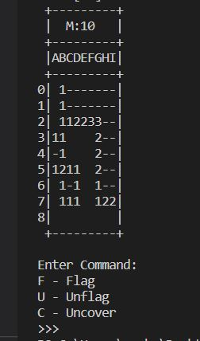
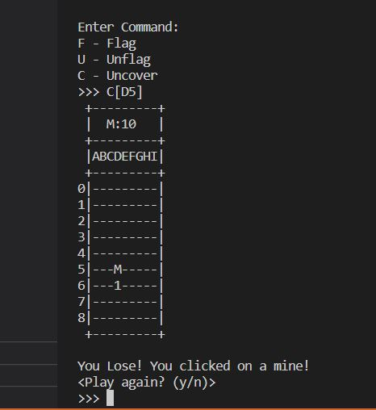

# Java Minesweeper

A simple Minesweeper program that runs in the terminal, written in Java.

Commands are typed in along with the cell to act on, and the game acts as a regular game of minesweeper, you must avoid uncovering bombs and flag them all to win the game!

This is one of my first finished Java projects.

## To use

There are 3 commands available:

+ F - Flag a tile
+ U - Unflag a tile
+ C - Uncover a tile

To enter a command, simple type the letter of the command, followed by the cell letter and the number.

For example, to flag tile D4, type:

```F[D4]```

## Images



A partially complete minesweeper game.



A very unlucky game, as well as an example of a command being input

## Requirements

Java
